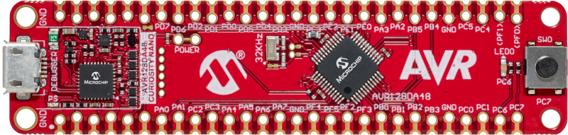
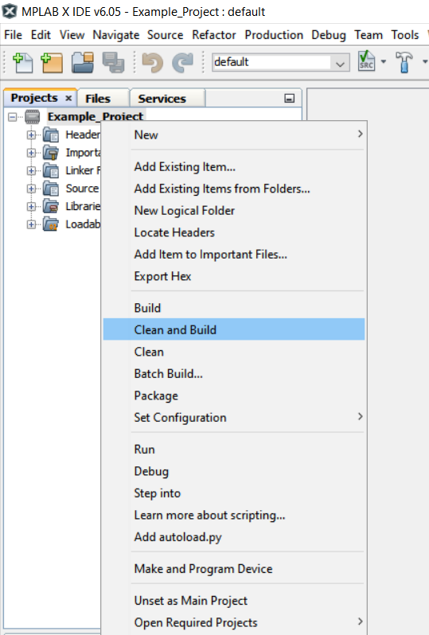
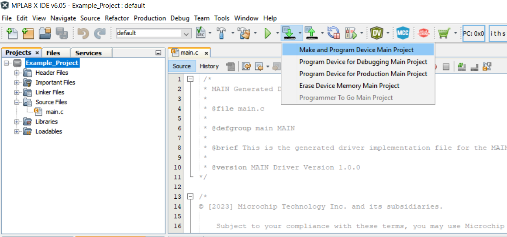

# External Interrupt Wake Up Example using the AVR128DA48 Microcontroller with MCC Melody

This repository provides an MCC Melody-generated code example for n external interrupt wake up using the MPLAB® X project.

## Related Documentation

More details and code examples on the AVR128DA48 can be found at the following links:
- [AVR128DA48 Product Page](https://www.microchip.com/wwwproducts/en/AVR128DA28)
- [AVR128DA48 Code Examples on GitHub](https://github.com/microchip-pic-avr-examples?q=avr128da48)

## Software Used

- [MPLAB® X IDE v6.05 or newer](http://www.microchip.com/mplab/mplab-x-ide)
- [MPLAB® XC8 2.40 or newer](http://www.microchip.com/mplab/compilers)
- [MPLAB® Data Visualizer](https://www.microchip.com/en-us/tools-resources/debug/mplab-data-visualizer)
- [AVR-Dx v2.3.272 Device Family Pack or newer](https://packs.download.microchip.com/)
- Logic analyzer software

## Hardware Used

- AVR128DA48 Curiosity Nano Development Board is used as a test platform. [(DM164151)](https://www.microchip.com/Developmenttools/ProductDetails/DM164151)
 

- Oscilloscope or Logic Analyzer

## Operation

To program the Curiosity Nano board with this MPLAB® X project, follow the steps provided in the [How to Program the Curiosity Nano Board](#how-to-program-the-curiosity-nano-board) chapter.  

## 1. Setup

The following peripheral and clock configurations are set up using MCC Melody for the AVR128DA48:

- Clock Control:
  - Default settings (Main Clock: 4 MHz)
   

- Interrupt Manager:
  - Global Interrupt Enable: Enabled
   

- SLPCTRL:
  - Sleep Enable: Enabled
  - Sleep Mode: Idle
  - Performance Mode: Auto
   

- Pin Grid View:
  - GPIO Input: PC6
  - GPIO Output: PC7
   

- Pins:
  - PC6:
    - GPIO
    - Input
    - Custom Name: SW0
    - Pull-up: Enabled
    - Input/Sense Configuration: Sense Falling Edge
  - PC7:
    - GPIO
    - Output
    - Custom Name: LED0
    - Inverted I/O: Enabled
  - 

The following pin configuration must be made for this project:

|  Pin  |    Configuration    |      Function       |
| :---: | :-----------------: | :-----------------: |
|  PC6  | Digital Input       | GPIO Pin - SW0      |
|  PC7  | Digital Output      | GPIO Pin - LED0     |

## 2. Demo:

In the main loop, the program starts by entering the CPU in Sleep Mode. When the button is pressed, the CPU wakes up and blinks the LED. After those operations, the CPU returns to Sleep Mode. The flowchart diagram is represented in the below picture:

 

To demonstrate the functionality of the example, SW0 (PC6) push-button and LED0 (PC7) on-board LED are used as in the next demo:

 

The next snapshot from the logic analyzer software is used to demonstrate the fixed amount of time while the LED0 is turned on (200ms), with different trigger times of the pressed button.

 

## 3. Summary
This example demonstrates a simple implementation of a sleep operation with an external interrupt triggering an LED blink.

##  How to Program the Curiosity Nano board

This chapter shows how to use the MPLAB X IDE to program an AVR® device with an Example_Project.X. This can be applied for any other projects. 

- Connect the board to the PC.

- Open the Example_Project.X project in MPLAB X IDE.

- Set the Example_Project.X project as main project.

  - Right click on the project in the **Projects** tab and click **Set as Main Project**.
     

- Clean and build the Example_Project.X project.

  - Right click on the **Example_Project.X** project and select **Clean and Build**.
     

- Select the **AVRxxxxx Curiosity Nano** in the Connected Hardware Tool section of the project settings:

  - Right click on the project and click **Properties**
  - Click on the arrow under the Connected Hardware Tool
  - Select the **AVRxxxxx Curiosity Nano** (click on the **SN**), click **Apply** and then click **OK**:
     

- Program the project to the board.
  - Right click on the project and click **Make and Program Device**.
     

 

- [Back to Setup](#1-setup)
- [Back to Demo](#2-demo)
- [Back to Summary](#3-summary) 
- [Back to Top](#external-interrupt-wake-up-example-using-the-avr128da48-microcontroller-with-mcc-melody)